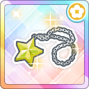
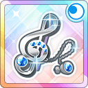
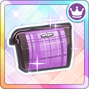
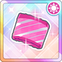

# アクセサリー

アクセサリーについての情報まとめ。アクセサリー一般についての情報も載せているが、虹アクセサリーが主な対象。

## 基本情報

* 1 アクセサリーのパラメータと効果は、装備している作戦のキャラ全員に掛かる。また、アクセサリーの属性と装備しているキャラの属性が一致すると、上昇するパラメータが 1.1 倍される。
  - 編成画面の各キャラのステータスは、アクセサリーによるパラメータ上昇後の値 (属性一致による 1.1 倍ボーナスを含む) となっている。
* スキルレベルが 1 上がるごとに効果量が `(レベル MAX の時の効果量 - レベル 1 の時の効果量)/(最大スキルレベル - 1)` ほど増える。(最大スキルレベルは、銀: 10, 金: 15, 虹: 20)
  - 例えば、虹ブローチの場合は、レベル 1 の時の効果量が 2.5 で、レベル MAX の時の効果量が 5.0、最大スキルレベル 20 であるため、1 レベル上がるごとに `(5.0 - 2.5)/(20 - 1) = 2.5/19 (= 0.13515...)` ほど上昇する。
  - ゲーム上では少数点第一位までしか表示されないが、実際のスコア計算時には、少なくとも少数点第二位が使われているとのこと (少数点第三位以降は恐らく切り捨て)
    - ただし、リボンとポーチは例外 (値が整数のため)
* 元気について
  - スタミナが多いほど効果量が大きくなる (最大スタミナで最大効果量)
  - 適用される効果量は恐らく `最大効果量 * 現在のスタミナ / 最大スタミナ` (要確認)

### 凸数ごとのパラメータ

パラメータはレベル最大時のもの。4凸 → 5凸 (完凸) 時のみ上限レベルが 10 上がりお得なため、複数アクセサリーの凸を目指している場合は、均等に凸させるより、1 つ完凸させてから次のアクセサリーの凸を目指す方が効率的。

| 凸数 | 上限レベル | 上限スキルレベル | 最大アピール | 最大スタミナ | 最大テクニック |
|------|------------|-----------------|--------------|--------------|---------------|
| 0 | 30 | 15 | 670 | 502 | 502 |
| 1 | 35 | 16 | 732 | 549 | 549 |
| 2 | 40 | 17 | 793 | 595 | 595 |
| 3 | 45 | 18 | 855 | 641 | 641 |
| 4 | 50 | 19 | 917 | 687 | 687 |
| 5 | 60 | 20 | 1040 | 780 | 780 |

### スキルレベルアップに必要なアクセサリー数

* 1 レベル 100% の確率で上げるには、`現在のスキルレベル * 2` 個の銀アクセサリーが必要。
  - 金アクセサリーは銀 5 個分、虹アクセサリーは銀 25 個分
  - 高レベルになるほど、100% 未満の合成で失敗した際のリスクが大きくなるので、基本的には 100% になる分のアクセサリーを使って、レベルを上げるのが良いと思われる。(逆に、銀アクセ 1 個とかで賭けにでるのも手。)
* 1 回の合成に使えるアクセサリーの数は 30
* 下表は、レアリティの小さいアクセサリーをなるべく使用するようにして、スキルレベルアップ確率 100% にするのに必要な最小のアクセサリー数をまとめたもの

| レベル | 必要銀アクセ数 | 必要金アクセ数 |
|--------|---------------|----------------|
| 1 -> 2 | 2 | 0 |
| 2 -> 3 | 4 | 0 |
| 3 -> 4 | 6 | 0 |
| 4 -> 5 | 8 | 0 |
| 5 -> 6 | 10 | 0 |
| 6 -> 7 | 12 | 0 |
| 7 -> 8 | 14 | 0 |
| 8 -> 9 | 16 | 0 |
| 9 -> 10 | 18 | 0 |
| 10 -> 11 | 20 | 0 |
| 11 -> 12 | 22 | 0 |
| 12 -> 13 | 24 | 0 |
| 13 -> 14 | 26 | 0 |
| 14 -> 15 | 28 | 0 |
| 15 -> 16 | 30 | 0 |
| 16 -> 17 | 27 | 1 |
| 17 -> 18 | 29 | 1 |
| 18 -> 19 | 26 | 2 |
| 19 -> 20 | 28 | 2 |
| 合計 | 350 | 6 |

## 各アクセサリーについて

### 星のイヤリング
| 画像 | 効果 |
|------------------------|------|
|  | **SP ケージ獲得 + (元気): 曲中**   残りスタミナが多いほど基本SPゲージ獲得量が上昇 (1.0% - 2.0%)   条件: 楽曲中 / 対象: 自身 |

#### スキルレベルごとの効果量

| スキルレベル | 効果量 (ゲーム内表示の値) |
|:-------------|:-------------------------|
| 1 | 1.0 (1.0) |
| 2 | 1.05 (1.0) |
| 3 | 1.10 (1.1) |
| 4 | 1.15 (1.1) |
| 5 | 1.21 (1.2) |
| 6 | 1.26 (1.2) |
| 7 | 1.31 (1.3) |
| 8 | 1.36 (1.3) |
| 9 | 1.42 (1.4) |
| 10 | 1.47 (1.4) |
| 11 | 1.52 (1.5) |
| 12 | 1.57 (1.5) |
| 13 | 1.63 (1.6) |
| 14 | 1.68 (1.6) |
| 15 | 1.73 (1.7) |
| 16 | 1.78 (1.7) |
| 17 | 1.84 (1.8) |
| 18 | 1.89 (1.8) |
| 19 | 1.94 (1.9) |
| 20 | 2.0 (2.0) |

### 星のネックレス

| 画像 | 効果 |
|------------------------|------|
|  | **ダメージ軽減 + (元気): 曲中**   残りスタミナが多いほどスタミナダメージを軽現 (1.0% - 2.0%)   条件: 楽曲中 |

#### スキルレベルごとの効果量

| スキルレベル | 効果量 (ゲーム内表示の値) |
|:-------------|:-------------------------|
| 1 | 1.0 (1.0) |
| 2 | 1.05 (1.0) |
| 3 | 1.10 (1.1) |
| 4 | 1.15 (1.1) |
| 5 | 1.21 (1.2) |
| 6 | 1.26 (1.2) |
| 7 | 1.31 (1.3) |
| 8 | 1.36 (1.3) |
| 9 | 1.42 (1.4) |
| 10 | 1.47 (1.4) |
| 11 | 1.52 (1.5) |
| 12 | 1.57 (1.5) |
| 13 | 1.63 (1.6) |
| 14 | 1.68 (1.6) |
| 15 | 1.73 (1.7) |
| 16 | 1.78 (1.7) |
| 17 | 1.84 (1.8) |
| 18 | 1.89 (1.8) |
| 19 | 1.94 (1.9) |
| 20 | 2.0 (2.0) |

### 音符のブローチ

| 画像 | 効果 |
|------------------------|------|
|  | **アピール + (元気): 曲中**   残りスタミナが多いほど基本アピールが増加 (2.5% - 5.0%)   条件: 楽曲中 / 対象: 自身 |

#### スキルレベルごとの効果量

| スキルレベル | 効果量 (ゲーム内表示の値) |
|:-------------|:-------------------------|
| 1 | 2.5 (2.5) |
| 2 | 2.63 (2.6) |
| 3 | 2.76 (2.7) |
| 4 | 2.89 (2.8) |
| 5 | 3.02 (3.0) |
| 6 | 3.15 (3.1) |
| 7 | 3.28 (3.2) |
| 8 | 3.42 (3.4) |
| 9 | 3.55 (3.5) |
| 10 | 3.68 (3.6) |
| 11 | 3.81 (3.8) |
| 12 | 3.94 (3.9) |
| 13 | 4.07 (4.0) |
| 14 | 4.21 (4.2) |
| 15 | 4.34 (4.3) |
| 16 | 4.47 (4.4) |
| 17 | 4.60 (4.6) |
| 18 | 4.73 (4.7) |
| 19 | 4.86 (4.8) |
| 20 | 5.0 (5.0) |

### 音符のキーホルダー

| 画像 | 効果 |
|------------------------|------|
|  | **特技発動率 + (元気): 曲中**   残りスタミナが多いほど基本特技発動率が増加 (2.5% - 5.0%)   条件: 楽曲中 / 対象: 自身 |

#### スキルレベルごとの効果量

| スキルレベル | 効果量 (ゲーム内表示の値) |
|:-------------|:-------------------------|
| 1 | 2.5 (2.5) |
| 2 | 2.63 (2.6) |
| 3 | 2.76 (2.7) |
| 4 | 2.89 (2.8) |
| 5 | 3.02 (3.0) |
| 6 | 3.15 (3.1) |
| 7 | 3.28 (3.2) |
| 8 | 3.42 (3.4) |
| 9 | 3.55 (3.5) |
| 10 | 3.68 (3.6) |
| 11 | 3.81 (3.8) |
| 12 | 3.94 (3.9) |
| 13 | 4.07 (4.0) |
| 14 | 4.21 (4.2) |
| 15 | 4.34 (4.3) |
| 16 | 4.47 (4.4) |
| 17 | 4.60 (4.6) |
| 18 | 4.73 (4.7) |
| 19 | 4.86 (4.8) |
| 20 | 5.0 (5.0) |

### フラワーのブレスレット

| 画像 | 効果 |
|------------------------|------|
|  | **SPゲージ獲得: AC 成功時**   自分のアピールに応じて SP ゲージを獲得 (2.5% - 5.0%)   条件: AC 成功時 |

#### ブレスレットの必要個数について

最大 SP は、難易度ごとに定まっている (初級: 3600, 中級: 4800, 上級: 6000) ので、SP 獲得量がこの値を超えてしまう場合、超過分は無意味なものとなる。そのため、ブレスレットのスキルレベル (効果量) と装備する作戦のアピール値に応じて、必要数を見積もると良い。具体的には、AC 成功時に獲得する総 SP ケージ量は、`1 作戦の合計アピール値 (※) * 1 作戦のブレスレットの合計効果量` を全作戦について足し合わせたものとなるため、この合計値が最大 SP (初級: 3600, 中級: 4800, 上級: 6000) をギリギリ下回るような個数にすれば良い。因みに、装備する作戦のアピールが高まると上級曲でも 2 個で足りるようになるとのこと。(恐ろしい…)

※: バフ、デバフの影響含む

#### スキルレベルごとの効果量

| スキルレベル | 効果量 (ゲーム内表示の値) |
|:-------------|:-------------------------|
| 1 | 2.5 (2.5) |
| 2 | 2.63 (2.6) |
| 3 | 2.76 (2.7) |
| 4 | 2.89 (2.8) |
| 5 | 3.02 (3.0) |
| 6 | 3.15 (3.1) |
| 7 | 3.28 (3.2) |
| 8 | 3.42 (3.4) |
| 9 | 3.55 (3.5) |
| 10 | 3.68 (3.6) |
| 11 | 3.81 (3.8) |
| 12 | 3.94 (3.9) |
| 13 | 4.07 (4.0) |
| 14 | 4.21 (4.2) |
| 15 | 4.34 (4.3) |
| 16 | 4.47 (4.4) |
| 17 | 4.60 (4.6) |
| 18 | 4.73 (4.7) |
| 19 | 4.86 (4.8) |
| 20 | 5.0 (5.0) |

### フラワーのヘアピン

| 画像 | 効果 |
|------------------------|------|
|  | **特技発動率 + (元気): 曲中**   残りスタミナが多いほど基本クリティカル値が増加 (2.5% - 5.0%)   条件: 楽曲中 / 対象: 自身 |

#### スキルレベルごとの効果量

| スキルレベル | 効果量 (ゲーム内表示の値) |
|:-------------|:-------------------------|
| 1 | 2.5 (2.5) |
| 2 | 2.63 (2.6) |
| 3 | 2.76 (2.7) |
| 4 | 2.89 (2.8) |
| 5 | 3.02 (3.0) |
| 6 | 3.15 (3.1) |
| 7 | 3.28 (3.2) |
| 8 | 3.42 (3.4) |
| 9 | 3.55 (3.5) |
| 10 | 3.68 (3.6) |
| 11 | 3.81 (3.8) |
| 12 | 3.94 (3.9) |
| 13 | 4.07 (4.0) |
| 14 | 4.21 (4.2) |
| 15 | 4.34 (4.3) |
| 16 | 4.47 (4.4) |
| 17 | 4.60 (4.6) |
| 18 | 4.73 (4.7) |
| 19 | 4.86 (4.8) |
| 20 | 5.0 (5.0) |

### チェックのリボン

| 画像 | 効果 |
|------------------------|------|
|  | **シールド獲得: AC 成功時**   発動時のコンボ数に応じてシールドを獲得 (150 コンボで最大 250 - 500)   条件: AC 成功時 / 確率: 30% |

#### スキルレベルごとの効果量

| スキルレベル | 効果量 (ゲーム内表示の値) |
|:-------------|:-------------------------|
| 1 | 250 (250) |
| 2 | 263 (263) |
| 3 | 276 (276) |
| 4 | 289 (289) |
| 5 | 302 (302) |
| 6 | 315 (315) |
| 7 | 328 (328) |
| 8 | 342 (342) |
| 9 | 355 (355) |
| 10 | 368 (368) |
| 11 | 381 (381) |
| 12 | 394 (394) |
| 13 | 407 (407) |
| 14 | 421 (421) |
| 15 | 434 (434) |
| 16 | 447 (447) |
| 17 | 460 (460) |
| 18 | 473 (473) |
| 19 | 486 (486) |
| 20 | 500 (500) |

### チェックのポーチ

| 画像 | 効果 |
|------------------------|------|
|  | **スタミナ回復 (コンボ): AC 成功時**   発動時のコンボ数に応じてスタミナを回復 (150 コンボで最大 250 - 500)   条件: AC 成功時 / 確率: 30% |

#### スキルレベルごとの効果量

| スキルレベル | 効果量 (ゲーム内表示の値) |
|:-------------|:-------------------------|
| 1 | 250 (250) |
| 2 | 263 (263) |
| 3 | 276 (276) |
| 4 | 289 (289) |
| 5 | 302 (302) |
| 6 | 315 (315) |
| 7 | 328 (328) |
| 8 | 342 (342) |
| 9 | 355 (355) |
| 10 | 368 (368) |
| 11 | 381 (381) |
| 12 | 394 (394) |
| 13 | 407 (407) |
| 14 | 421 (421) |
| 15 | 434 (434) |
| 16 | 447 (447) |
| 17 | 460 (460) |
| 18 | 473 (473) |
| 19 | 486 (486) |
| 20 | 500 (500) |

### ボーダーのリストバンド

| 画像 | 効果 |
|------------------------|------|
|  | **アピール UP: 曲開始時**   10ノーツの間アピールが増加 (2.5% - 5.0%)   条件: 楽曲開始時 / 確率: 30% / 対象: 自身 |

#### スキルレベルごとの効果量

| スキルレベル | 効果量 (ゲーム内表示の値) |
|:-------------|:-------------------------|
| 1 | 2.5 (2.5) |
| 2 | 2.63 (2.6) |
| 3 | 2.76 (2.7) |
| 4 | 2.89 (2.8) |
| 5 | 3.02 (3.0) |
| 6 | 3.15 (3.1) |
| 7 | 3.28 (3.2) |
| 8 | 3.42 (3.4) |
| 9 | 3.55 (3.5) |
| 10 | 3.68 (3.6) |
| 11 | 3.81 (3.8) |
| 12 | 3.94 (3.9) |
| 13 | 4.07 (4.0) |
| 14 | 4.21 (4.2) |
| 15 | 4.34 (4.3) |
| 16 | 4.47 (4.4) |
| 17 | 4.60 (4.6) |
| 18 | 4.73 (4.7) |
| 19 | 4.86 (4.8) |
| 20 | 5.0 (5.0) |

### ボーダーのタオル

| 画像 | 効果 |
|------------------------|------|
|  | **特技発動率 UP: 曲開始時**   10ノーツの間特技発動率が増加 (2.5% - 5.0%)   条件: 楽曲開始時 / 確率: 30% / 対象: 自身 |

#### スキルレベルごとの効果量

| スキルレベル | 効果量 (ゲーム内表示の値) |
|:-------------|:-------------------------|
| 1 | 2.5 (2.5) |
| 2 | 2.63 (2.6) |
| 3 | 2.76 (2.7) |
| 4 | 2.89 (2.8) |
| 5 | 3.02 (3.0) |
| 6 | 3.15 (3.1) |
| 7 | 3.28 (3.2) |
| 8 | 3.42 (3.4) |
| 9 | 3.55 (3.5) |
| 10 | 3.68 (3.6) |
| 11 | 3.81 (3.8) |
| 12 | 3.94 (3.9) |
| 13 | 4.07 (4.0) |
| 14 | 4.21 (4.2) |
| 15 | 4.34 (4.3) |
| 16 | 4.47 (4.4) |
| 17 | 4.60 (4.6) |
| 18 | 4.73 (4.7) |
| 19 | 4.86 (4.8) |
| 20 | 5.0 (5.0) |
